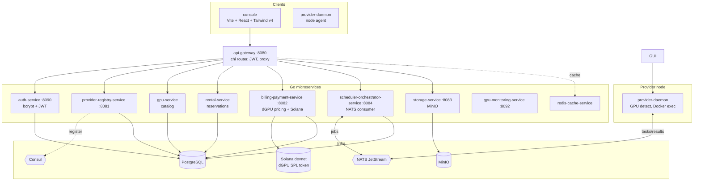

# DanteGPU Core

Decentralized GPU rental marketplace on Solana. Providers list idle GPUs, renters
pay by the minute in the dGPU SPL token, and a set of Go microservices coordinate
discovery, scheduling, metering, and settlement.

DanteGPU Core is the **coordination and billing layer**, not an inference engine.
It owns the marketplace: who is renting, what they pay, how a job reaches a
provider, and how the provider gets settled on-chain. The actual compute runs on
the provider node (Docker or a script executor managed by the provider daemon).

> Status: working MVP backbone, not production. The core path (list, discover,
> rent, run) is real and runs on real PostgreSQL, NATS, Consul, MinIO, and Solana
> devnet. One caveat up front: the api-gateway still authenticates against an
> in-memory mock user map (the React frontend already talks to the real
> auth-service), and replacing it is the first roadmap item. Several other edges are
> deliberately stubbed and are tracked honestly below and in [ROADMAP.md](ROADMAP.md).
> If a feature is not listed as working here, assume it is not wired yet.

## The marketplace in six verbs

The whole system is a six-step lifecycle. This table is the honest state of each
step (see [docs/STATUS.md](docs/STATUS.md) for the per-service breakdown).

| Verb | What happens | Services | State |
|------|--------------|----------|-------|
| **LIST** | A provider registers and its GPUs are detected | `provider-registry-service`, `provider-daemon` | Working (NVIDIA solid; AMD via rocm-smi, Apple via system_profiler, with some hardcoded VRAM mappings) |
| **DISCOVER** | A renter browses the catalog | `gpu-service`, `console` | Working (read path) |
| **RENT** | A renter reserves a GPU and funds are locked | `rental-service`, `billing-payment-service` | Working (USDC billing; on-chain Covenant escrow opened on session start) |
| **RUN** | A job is dispatched and executed on the provider | `scheduler-orchestrator-service`, `provider-daemon` | Working (NATS dispatch + Docker exec; matching by type, count, VRAM and power; K8s extender is an unused stub) |
| **METER** | Usage is sampled per second | `provider-daemon`, `billing-payment-service` | Working (real per-vendor GPU metrics threaded into the billing session) |
| **SETTLE** | The provider is paid in USDC on Solana | `billing-payment-service` | Partial (Phase 1 fixed-duration on-chain settlement via Covenant; metered refund is the open work) |

The honest one-line summary: **you can list a GPU, find it, rent it in USDC, run a
job, and have the session settle on-chain via Covenant; the remaining open work is
true metered (partial) refund and mainnet hardening.**

Want proof rather than claims? `./scripts/rental-proof.sh` runs the whole loop
end to end with real code on a throwaway Postgres + NATS (no Docker/NVIDIA
needed): it detects this host's GPU, prices the rental, persists a metered
session to Postgres and reads it back, then dispatches a task over NATS that the
daemon actually executes. See [docs/PROOF.md](docs/PROOF.md) for a real run.

## Architecture



Each service is an independent Go module under its own directory. They share types
through `common/` and discover each other through Consul. Inter-service events
(job submission, task dispatch, results) flow over NATS JetStream.

## The billing model

This is the part of the system that is most fully built and the reason the project
exists. Pricing is computed with `shopspring/decimal` (no float money) in
`billing-payment-service/internal/pricing/engine.go`:

```
total_hourly = base_rate(gpu_model)
             + vram_rate_per_gb * allocated_vram_gb
             + power_multiplier * estimated_power_kw
adjusted     = total_hourly * demand_multiplier - base_rate * supply_bonus
cost         = adjusted * duration_hours
platform_fee = cost * platform_fee_percent
provider_earnings = cost - platform_fee
```

Wallets, balances, deposits, and withdrawals are real Solana RPC calls
(`gagliardetto/solana-go`) against the dGPU SPL token (configurable mint, devnet by
default). Funds are locked in PostgreSQL when a rental starts.

Two honest caveats:

- **Dynamic pricing is a stub.** `getDynamicPricingFactors()` returns a fixed
  `demand=1, supply=0`. The supply/demand signal is meant to come from
  `provider-registry-service` and is not wired yet, so prices do not actually move
  with the market.
- **Provider payout is recorded, not paid.** Ending a rental writes a
  `provider_payouts` row but no background worker executes the on-chain transfer
  yet. Renter-side balance accounting is correct; provider-side disbursement is the
  open loop.

## Data model

The strongest artifact in the repo is the schema: 13 migrations under
`database/migrations/`, roughly 68 tables modeling users and auth, the GPU
marketplace (providers, capabilities, instances, reservations), Solana billing
(wallets, blockchain transactions, rental sessions, escrow, platform fees, provider
payouts), and the job lifecycle (jobs, logs, metrics, files, checkpoints,
dependencies). It includes monthly partitioning for high-volume log and metric
tables, stored procedures for wallet fund lock/release, and views for billing and
analytics.

## Quick start

Requirements: Docker with Compose, Go 1.23+, Node 20+ (for the frontend).

```bash
git clone https://github.com/dante-gpu/dantegpu-core.git
cd dantegpu-core
cp env.production.example .env   # then edit secrets

# Bring up infra + services
docker compose up -d

# Apply database migrations
./database/run_migrations.sh
```

Core service ports once the stack is up:

| Port | Service |
|------|---------|
| 8080 | api-gateway |
| 8081 | provider-registry-service (listens on 8002 internally) |
| 8082 | billing-payment-service |
| 8083 | storage-service |
| 8084 | scheduler-orchestrator-service |
| 8090 | auth-service |
| 8092 | gpu-monitoring-service |
| 5174 | console (web frontend) |

Supporting infra runs on its standard ports: PostgreSQL 5432, Redis 6379, NATS
4222 (monitoring 8222), Consul 8500, MinIO 9000/9001, Prometheus 9090, Grafana
3000, Loki 3100.

To build a single service directly (each is its own module):

```bash
cd billing-payment-service && go build ./...
```

`gpu-service`, `rental-service`, and `provider-registry-service` build clean with
`go build ./...` on Go 1.24.

## Repository layout

```
services/                     Backend Go microservices (one module each)
  api-gateway/                Edge router: JWT auth, CORS, Consul/NATS, proxy
  auth-service/               PostgreSQL + bcrypt + JWT identity
  provider-registry-service/  Provider + GPU-capability registry (Consul)
  gpu-service/                Read-only GPU catalog
  rental-service/             Rental reservations and lifecycle
  billing-payment-service/    Pricing engine + Solana wallets/settlement (USDC)
  scheduler-orchestrator-service/  NATS job consumer + (stub) K8s extender
  storage-service/            MinIO-backed object storage
  gpu-monitoring-service/     nvidia-smi metrics + WebSocket stream
  redis-cache-service/        Cache helpers (library, imported by services)
clients/                      Apps and node agents
  console/                    DanteGPU web console (Vite + React + Tailwind v4):
                              marketplace, rent flow, USDC wallet, provider dashboard
  provider-daemon/            Provider node agent: GPU detect, Docker/script exec
contracts/                    On-chain settlement integration (Covenant) + future programs
common/                       Shared Go types and utilities (root module)
cmd/                          Root-module executables (provider, rental, tooling)
database/migrations/          13 SQL migrations (the canonical schema)
infrastructure/               Redis/MinIO/NATS/Consul/Prometheus config
monitoring-logging-service/   Prometheus + Grafana + Loki + Alertmanager stack
k8s/                          Staging and production manifests
docs/                         Architecture, runbook, API reference, status
```

Note: the Go module namespace is `github.com/dante-gpu/dante-backend` (historical),
while the repository is `dantegpu-core`.

## Known limitations

Kept here so the README never overclaims. Full detail and the plan to close each is
in [ROADMAP.md](ROADMAP.md).

- **api-gateway has mock users.** `api-gateway/internal/auth/user.go` holds a
  hardcoded in-memory `user`/`admin` map. The gateway does not yet call
  `auth-service` for identity. This is the highest-priority correctness fix.
- **Gateway billing endpoints return mock data.** `GetUserBalance` returns a
  hardcoded `100.0` and `GetUserWallet` returns "not yet implemented"; both are
  placeholders pending a real billing client. Live but fake.
- **Metering does not reach billing.** `gpu-monitoring-service` collects real
  metrics but does not publish usage to `billing-payment-service`.
- **On-chain escrow and payout are incomplete** (see the billing section).
- **Not implemented despite past claims:** two-factor auth, OAuth2, on-chain smart
  contracts, multi-signature wallets, and Stripe/PayPal payments. Billing is
  Solana-only. GPU detection is real for NVIDIA (`nvidia-smi`), AMD (`rocm-smi`),
  and Apple Silicon (`system_profiler`), but several VRAM values are hardcoded
  mappings rather than queried.
- **Test coverage is thin:** about 8 test files, mostly SQL-mocked unit tests plus
  three integration suites that assume a running stack. The real services
  (`billing-payment-service`, `scheduler-orchestrator-service`,
  `provider-registry-service`) have no unit tests yet.

A previous generation of triumphant progress reports (MISSION_ACCOMPLISHED and
friends) and self-congratulatory "audit passed" documents have been removed; they
described an idealized system, not this one. They remain in git history if needed.

## Documentation

- [ROADMAP.md](ROADMAP.md): phased plan with pass/fail criteria
- [docs/STATUS.md](docs/STATUS.md): per-service reality matrix
- [docs/ARCHITECTURE.md](docs/ARCHITECTURE.md): system architecture
- [docs/ARCHITECTURE-TR.md](docs/ARCHITECTURE-TR.md): architecture (Turkish)
- [docs/API_DOCUMENTATION.md](docs/API_DOCUMENTATION.md): API reference
- [docs/RUNBOOK.md](docs/RUNBOOK.md): operations runbook
- [CONTRIBUTING.md](CONTRIBUTING.md): development workflow

## License

[MIT](LICENSE)
